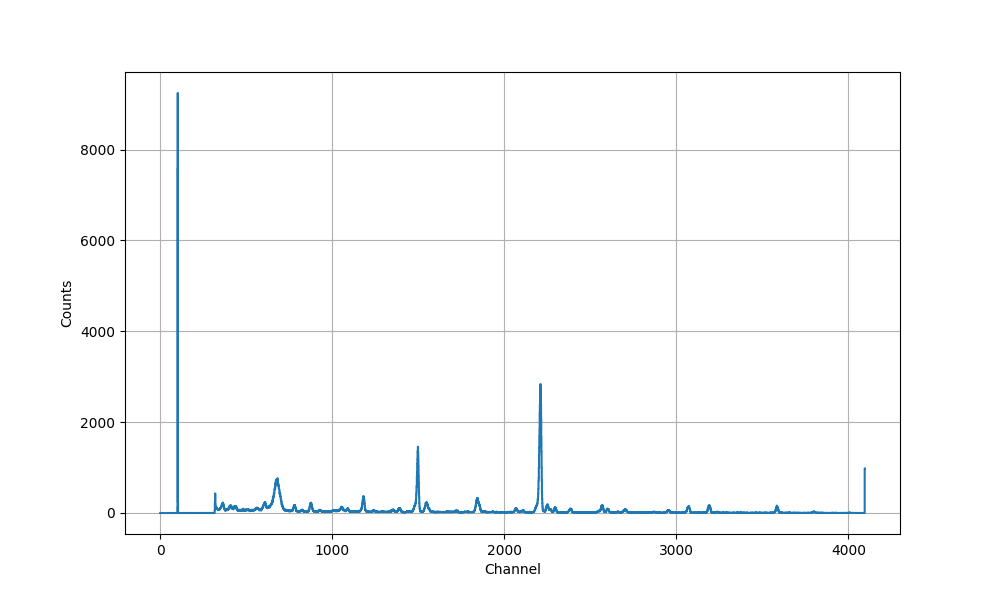
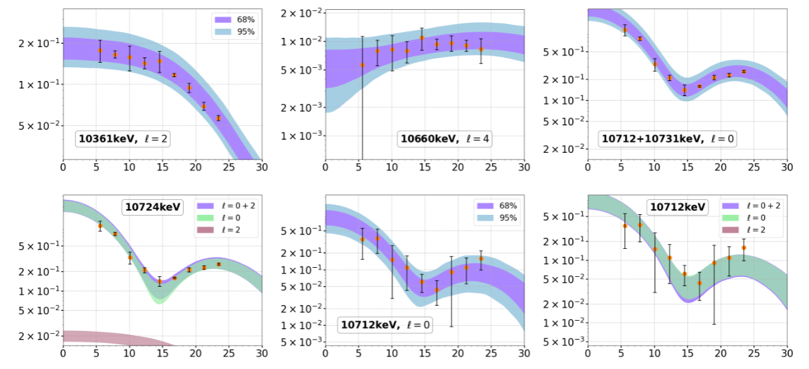
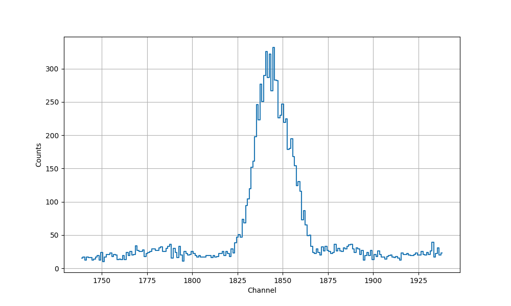
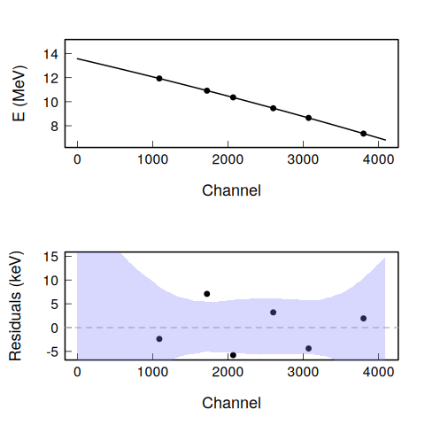
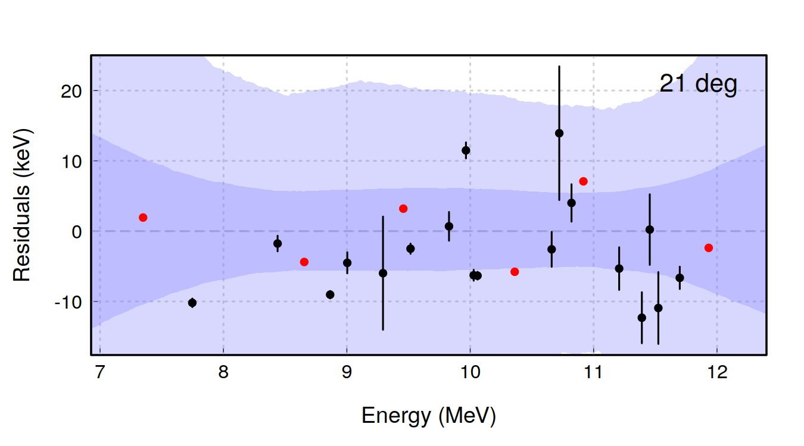
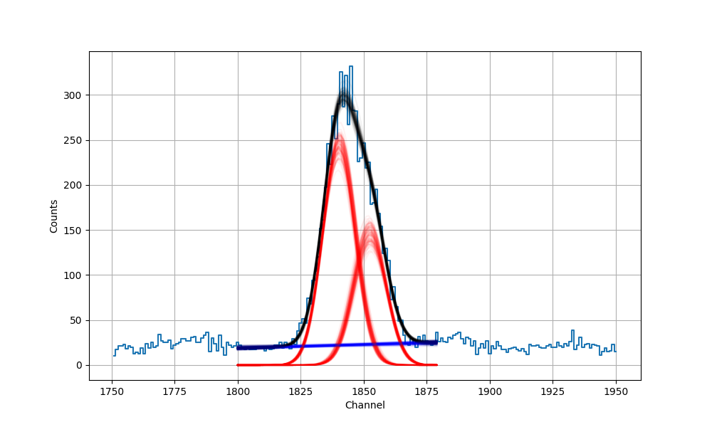

#+OPTIONS: num:t
#+OPTIONS: toc:nil
#+OPTIONS: timestamp:nil
#+TITLE: Fitting the Close Doublet in Kaixin's Data
#+author: Richard Longland
#+REVEAL_EXTRA_CSS: ./presentation.css
#+REVEAL_INIT_OPTIONS: width:1200, height:800, controlsLayout: 'edges', transition:'fade', slideNumber:'c/t', center:false, progress:'true', history:'true', controls:'true', overview:'true'
#+REVEAL_HLEVEL: 2
#+REVEAL_THEME: white
#+REVEAL_ROOT: https://cdn.jsdelivr.net/npm/reveal.js

* The Goal
  - Kaixin's Data
    
  - Goal is to extract spectroscopic information on all states populated in \nbsp{}^{24}Mg through the \(^{23}\)Na(^{3}He,d) proton transfer reaction.
  
** Progress so far
   Kaixin has made great progress in
   - extracting cross sections
   - Markov Chain Monte Carlo DWBA calculations
   - etc.
     

* The Problem
  Some of the differential cross sections are hard to extract
  

** Usual method
   Either
   #+REVEAL_HTML: 

   - Fit 2 Gaussian functions
     - Assume complete ignorance
     - Allow the computer to decide what is most likely
   - *Curves overlap*
   - *Very large uncertainties*
   #+REVEAL_HTML: 

   #+REVEAL_HTML: 

   - From the known excitation energy
     - Predict the centroids of the peaks
     - Fit 2 Gaussian functions with /fixed/ position
   - *Curves forced into position*
   - *Underpredict uncertainties*
   #+REVEAL_HTML: 

** We know more from ENSDF
   #+REVEAL_HTML: 

   #+name: CalLines
   Calibration lines
   | Ex (MeV) | dEx (MeV) |     Chn |     dChn |
   |----------+-----------+---------+----------|
   |   7.3486 |    0.0001 | 3798.96 |  0.38028 |
   |   8.6549 |    0.0004 | 3070.03 |  0.18573 |
   |  9.45781 |   0.00005 | 2600.64 | 0.310776 |
   |  10.3607 |    0.0003 | 2068.32 | 0.235831 |
   |  10.9172 |    0.0003 | 1720.63 |  0.81847 |
   |  11.9329 |    0.0002 | 1088.21 | 0.378985 |

   Lines of interest
   | Ex (MeV) | dEx (MeV) |
   |----------+-----------|
   |  10.7122 |    0.0002 |
   |  10.7311 |    0.0002 |

   #+REVEAL_HTML: 

   #+REVEAL_HTML: 

   
   #+REVEAL_HTML: 

** Residuals
   
** Summary:
   1) Know energy \pm uncertainty
   2) From calibration \rightarrow *channel \pm uncertainty*
   3) (from nearby peaks, know *width \pm uncertainty*)
   4) Feed these in as /prior knowledge/ in Bayesian fit
* Final result
  
  #+begin_src org
  Peak 1 Position = Channel 1852.44 +/- 0.38
  Peak 1 Area = 2381.72 +/- 127.48
  Peak 2 Position = Channel 1840.31 +/- 0.26
  Peak 2 Area = 3970.84 +/- 140.07
  #+end_src

